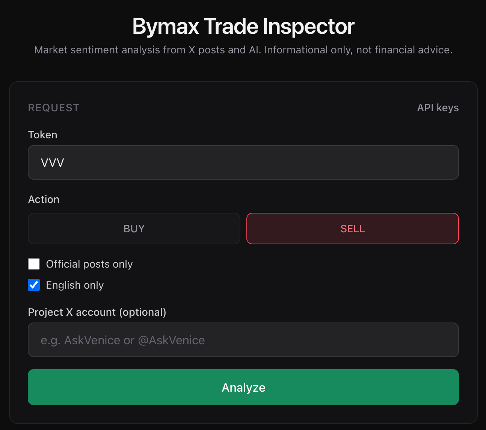
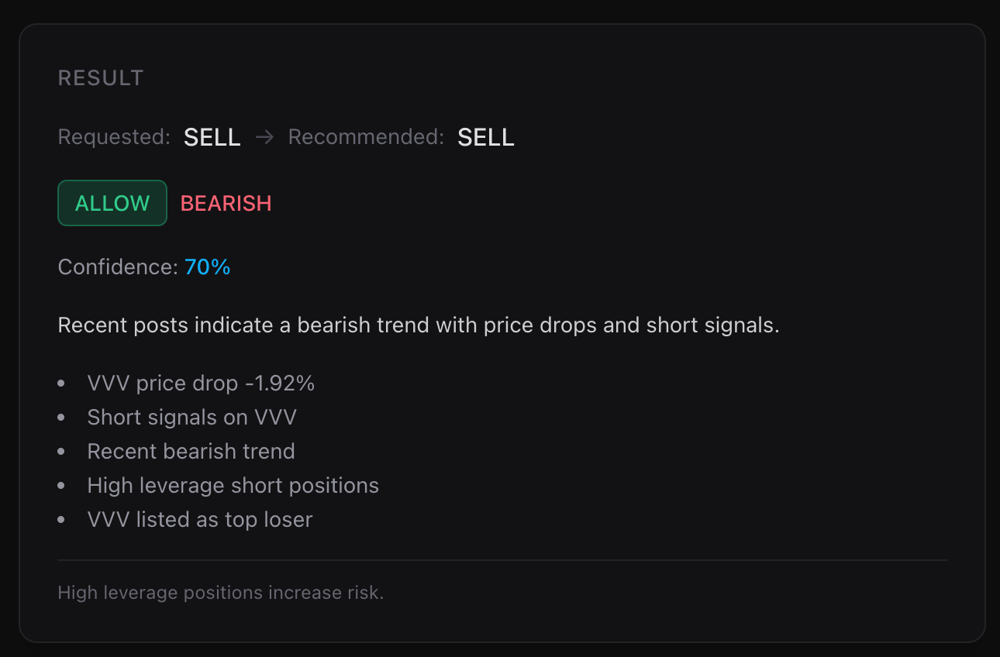
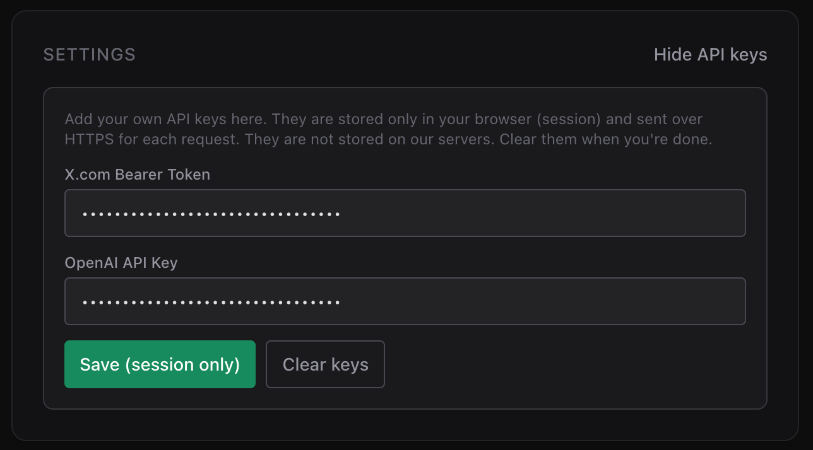

# 📊 Bymax Trade Inspector

[](LICENSE)
[](https://nodejs.org/)
[](https://nextjs.org/)
[](https://react.dev/)
[](https://www.typescriptlang.org/)
[](https://tailwindcss.com/)
[](https://developer.x.com/)
[](https://openai.com/)
[](https://zod.dev/)
[](https://react-hook-form.com/)

**Market sentiment analysis from X.com posts and AI.** You inform a **buy or sell intention** for a crypto token; the AI analyzes whether it’s **viable** based on **market sentiment** reflected in real posts from **X.com** — one of the best sources for crypto research and real-time discussion.

> **Informational only.** This project does not execute trades and is not financial advice.

---

## 🎯 What it does

- **Integrates X.com API** — Fetches recent posts about the token via the [X API v2 Recent Search](https://developer.x.com/en/docs/twitter-api/tweets/search/api-reference/get-tweets-search-recent) endpoint.
- **Integrates AI (GPT‑4o)** — Uses OpenAI to perform **sentiment analysis** (bullish, bearish, mixed, unclear) and recommends **BUY**, **SELL**, or **HOLD** according to the mood of the market as seen in those posts. The app uses **gpt-4o with temperature 0** for **consistent, predictable results** (see [Model choice](#-model-choice-gpt-4o--temperature) below).
- **Single dashboard** — Enter a token symbol (e.g. SOL, BTC, ETH), choose your **intention** (BUY or SELL), and get a clear **viability** answer plus the reasoning and the posts that drove the analysis.

X.com is a major hub for crypto conversations; this app turns that signal into a structured, AI-backed read on whether your intended action aligns with current sentiment.

---

## 📸 How it looks

The dashboard is organized in three main areas, in order:

### 1. Request form

Here you enter the **token** (e.g. SOL, BTC, ETH), choose **BUY** or **SELL**, and optionally filter by official posts only, English only, or a project X account. You can also open **API keys** to use your own X and OpenAI keys (see [API keys](#-api-keys-in-the-browser) below).



### 2. Result card

After you run the analysis, the **Result** card shows the **requested** vs **recommended** action, **decision** (ALLOW / ABORT / REVERSE), **bias** (BULLISH / BEARISH / MIXED / UNCLEAR), **confidence** (with color: sky = reliable, amber = not reliable), the **reason**, key factors, and safety notes.



### 3. Top posts used

The list shows the **top posts** fetched from X.com, sorted newest first. Posts that were **actually used by the AI** for the decision are marked with a 🤖 icon and a green highlight; the legend under the title explains this. Each post shows engagement and a link to X.


---

## ✨ Features

| Feature                 | Description                                                                                                                                                                                                                                           |
| ----------------------- | ----------------------------------------------------------------------------------------------------------------------------------------------------------------------------------------------------------------------------------------------------- |
| **📝 Request form**     | Token (uppercase), BUY/SELL intention, optional filters: official posts only, English only, project X account. Form resets to default after a successful analysis.                                                                                    |
| **🔑 API keys**         | Optional panel to add your own **X Bearer Token** and **OpenAI API Key**. Keys are stored **only in the browser (session)** and sent over HTTPS per request; they are **not** stored on our servers. Ideal for public deploys or trying without env.  |
| **📡 X API usage card** | Shows **credit** (posts/month cap), **used** (posts consumed), **remaining**, and **cap resets**. Loads on page open and updates after each analysis. Data from `GET /2/usage/tweets`. Visible when keys are available (env or session).              |
| **📊 Result card**      | **Requested** vs **Recommended** action, **Decision** (ALLOW / ABORT / REVERSE), **Bias** (BULLISH / BEARISH / MIXED / UNCLEAR), **Confidence** with color (sky = reliable, amber = not reliable, zinc = neutral), reason, key factors, safety notes. |
| **📋 Top posts list**   | Up to **50 posts** (from 100 fetched), sorted **newest first**. Engagement score, link to X. **🤖 Robot icon** on posts actually used by the AI for the decision, with legend.                                                                        |
| **🧠 AI logic**         | Prompt aligns **bias** with **recommended_action**: e.g. BEARISH + confidence ≥ 0.6 → SELL; BULLISH + confidence ≥ 0.6 → BUY; HOLD when MIXED/UNCLEAR or low confidence.                                                                              |
| **🔧 Post selection**   | Engagement score, recency boost, author boost (verified, followers), spam penalty (giveaways, heavy emoji). Dedup by normalized text. Max 2 posts per author in top slots.                                                                            |

---

## 🔑 API keys (in the browser)

You can run the app in two ways:

1. **Environment variables** — Set `X_BEARER_TOKEN` and `OPENAI_API_KEY` in `.env.local` (or Vercel env). The server uses these for every request. No keys are sent from the browser. **If env keys are set, the app uses them by default:** the **API keys** settings panel is not shown when you submit the form; it only appears when neither env nor session keys are available.
2. **API keys in the browser** — Click **API keys** on the dashboard. Enter your **X.com Bearer Token** and **OpenAI API Key**, then **Save (session only)**. They are stored only in your browser’s **session storage** and sent with each analysis request over HTTPS. They are **not** stored on our servers. Use **Clear keys** to remove them; the form inputs are cleared and the usage card hides until keys are set again.



This is useful for **public deploys** (e.g. Vercel without env): visitors can paste their own keys and run analyses. Keys are never logged or persisted server-side.

---

## 🧠 Model choice: gpt-4o + temperature

The app uses **gpt-4o** by default with **temperature 0** for the analysis step.

- **Predictability** — With `temperature: 0`, the same posts and prompt produce the same recommendation and confidence. You avoid random variation between runs (e.g. SELL in one run and HOLD in another for the same data).
- **Fit for this task** — The job is bounded: fixed input (posts + intention) and fixed output (JSON with bias, confidence, recommendation). It doesn’t need the extra reasoning depth of models like gpt-5.2; gpt-4o is enough and more stable for this use case.
- **Reasoning models** — Models such as gpt-5.2 do **not** support the `temperature` parameter (API returns “Unsupported parameter”). So for deterministic results, gpt-4o with temperature 0 is the supported option.

You can override the model via `OPENAI_MODEL` in `.env.local` (e.g. `gpt-4o-mini`). For models whose id starts with `gpt-4o`, the app still sends `temperature: 0`; for others (e.g. gpt-5.2), it omits temperature to avoid API errors.

---

## ⚡ Next.js server-side: how it works and why it matters

This project is built on **Next.js App Router** and uses **server-side features** so that sensitive logic and API keys stay on the server and the UI stays fast and secure.

### What runs on the server

| Piece                                            | Role                                                                                                                                                |
| ------------------------------------------------ | --------------------------------------------------------------------------------------------------------------------------------------------------- |
| **Server Actions** (`src/app/actions.ts`)        | All X.com and OpenAI calls run here. The client never receives API keys or raw API responses.                                                       |
| **Server Components** (`layout.tsx`, `page.tsx`) | The root layout and the home page are Server Components: they render on the server and send HTML. Metadata (title, description) is set server-side. |
| **Node.js runtime**                              | The app uses the Node.js runtime (`runtime = "nodejs"` on the page) so Server Actions can call external APIs with env vars.                         |

### Server Actions in this project

- **`getUsage(formData?)`** — Fetches X API usage (`GET /2/usage/tweets`). Called on page load (with env or session keys) and after saving API keys. Runs only on the server.
- **`runAnalysis(formData)`** — Validates the form, fetches posts from X, runs the AI analysis (OpenAI), then fetches usage again. The client sends only the form data; all X and OpenAI requests are made from the server.

The dashboard (form, result, posts) is a **Client Component** that calls these actions via `useActionState` and `formAction`. No API routes or custom backend are used; **Server Actions are the only server entry points**.

### Why this adds value

- **Security** — X Bearer Token and OpenAI API key are used only inside Server Actions. They are never bundled or exposed to the browser; at most, the user sends them over HTTPS in the request body, and the server uses them without persisting.
- **Simplicity** — No separate API layer: the same Next.js app handles UI and “backend”. One deployment, one codebase.
- **Progressive enhancement** — The form can submit via Server Action; if needed, the same action can be invoked from other clients later.
- **Control** — Rate limits, validation, and error handling live on the server; the client only displays loading state and results.

---

## 🛠 Prerequisites

- **Node.js** 20+ (LTS recommended). Check with `node -v`.
- **pnpm** (recommended), npm, or yarn.
- **X Developer Account** with API access (Bearer Token).
- **OpenAI API key** (default model: **gpt-4o**).

---

## 🚀 Installation

1. **Clone the repository**

   ```bash
   git clone https://github.com/msalvatti/bymax.trade-inspector.git
   cd bymax.trade-inspector
   ```

2. **Install dependencies**

   ```bash
   pnpm install
   # or: npm install
   ```

3. **Configure environment**

   Copy the example env file and set your keys:

   ```bash
   cp .env.local.example .env.local
   ```

   Edit `.env.local`:

   - `X_BEARER_TOKEN` — X.com API Bearer Token (required).
   - `OPENAI_API_KEY` — OpenAI API key (required).

   Optional:

   - `X_API_BASE_URL` — Default: `https://api.x.com`.
   - `OPENAI_MODEL` — Default: `gpt-4o`. Use `gpt-4o` (or `gpt-4o-mini`) for temperature 0 and predictable results; other models (e.g. gpt-5.2) do not support temperature.

4. **Run locally**

   ```bash
   pnpm dev
   # or: npm run dev
   ```

   Open [http://localhost:3000](http://localhost:3000).

---

## ⚙️ Configuration

| Variable         | Required | Description                                                        |
| ---------------- | -------- | ------------------------------------------------------------------ |
| `X_BEARER_TOKEN` | Yes\*    | X.com API Bearer Token (OAuth 2.0 App-only).                       |
| `OPENAI_API_KEY` | Yes\*    | OpenAI API key.                                                    |
| `X_API_BASE_URL` | No       | X API base URL (default: `https://api.x.com`).                     |
| `OPENAI_MODEL`   | No       | Model for analysis (default: `gpt-4o`). gpt-4o uses temperature 0. |

\*Required for server-side use. Alternatively, users can provide keys via the **API keys** panel in the browser (session only).

All API calls run on the server; do **not** use `NEXT_PUBLIC_` for these variables.

---

## 🌐 Deploy on Vercel

1. Push the repo to GitHub (or connect your Git provider in Vercel).
2. In [Vercel](https://vercel.com), **Import** the project.
3. In **Settings → Environment Variables**, add:
   - `X_BEARER_TOKEN`
   - `OPENAI_API_KEY`
     Optionally add `OPENAI_MODEL`, `X_API_BASE_URL` if needed.
4. Deploy. No extra config required; the app uses the Node.js runtime.

If you don’t set env vars, visitors can still use the app by opening **API keys** and entering their own X and OpenAI keys (session only).

---

## 📁 Project structure

```
├── src/
│   ├── app/
│   │   ├── actions.ts           # Server Action (run analysis, get usage)
│   │   ├── layout.tsx
│   │   ├── page.tsx
│   │   ├── globals.css
│   │   └── components/
│   │       ├── TradeForm.tsx    # Request form, BUY/SELL, filters, API keys panel
│   │       ├── ResultCard.tsx   # Decision, bias, confidence, reason
│   │       ├── UsageCard.tsx    # X API usage (credit, used, remaining)
│   │       ├── PostsList.tsx    # Top posts, robot icon for AI-used
│   │       └── Footer.tsx       # Footer
│   └── lib/
│       ├── analysisFormSchema.ts # Shared Zod schema for analysis form (client + server)
│       ├── env/                  # Zod-validated env loader, optional overrides
│       ├── x/                    # X API client, query builder, search, usage
│       ├── ai/                   # OpenAI client, prompt, schema, analyze (gpt-4o + temp 0)
│       └── analysis/             # Post scoring, dedup, top-N selection
├── docs/
│   └── REQUIREMENTS.md          # Full product and technical requirements
├── public/
│   └── img/                     # Screenshots: form.png, results.png, posts.png
├── AGENTS.md                    # Guidelines for AI agents (Next.js, RHF, Zod, Tailwind, etc.)
├── .env.local.example
├── next.config.ts
├── package.json
├── tsconfig.json
└── postcss.config.mjs
```

- **app** — Next.js App Router; single route; Server Action for form submit and usage fetch.
- **lib/x** — X API v2 Recent Search + `GET /2/usage/tweets`; query building; response mapping.
- **lib/ai** — OpenAI chat completion (JSON); Zod schema; prompt with bias/recommendation rules; gpt-4o with temperature 0 when applicable.
- **lib/analysis** — Engagement, recency, author, spam; dedup; top 50 with author diversity.

---

## 🤖 For AI agents and contributors

The project includes **[AGENTS.md](AGENTS.md)** with detailed guidelines for AI agents and contributors:

- **Next.js** — Server-first; when to use Server Components vs Client Components; Server Actions and validation.
- **APIs** — All X and OpenAI calls server-side; env and optional form overrides; error handling.
- **React Hook Form + Zod** — Single shared schema (`src/lib/analysisFormSchema.ts`) for client and server; no duplicate validation.
- **Tailwind** — Palette (zinc, emerald, rose, amber, sky), spacing with `gap-*`, and consistent sections.
- **TypeScript & React** — Named components, no `any`, strict types, one main component per file.
- **Comments and UI text** — All in English; comment non-obvious logic; user-facing strings in English.

Use **AGENTS.md** as the main reference when implementing or refactoring; see **docs/REQUIREMENTS.md** for full product and technical requirements.

---

## 🧩 Tech stack

- **Next.js 16** (App Router), **TypeScript**, **Tailwind CSS v4** — with **Server Actions** and **Server Components** for all backend logic (see [Next.js server-side](#-nextjs-server-side-how-it-works-and-why-it-matters)).
- **React Hook Form** + **Zod** + **@hookform/resolvers** for form validation; form resets to default after successful analysis
- **OpenAI** SDK for server-side analysis (default model: **gpt-4o**, temperature 0 for predictability)
- API keys can be provided via env or via the **API keys** panel (browser session only; not stored on server)

---

## 📌 Rate limits and safe usage

- **X API** — Recent Search and Usage have rate limits (e.g. 450 requests per 15 minutes app-level). Use sparingly; avoid automated high-frequency runs.
- **OpenAI** — Subject to your account’s rate and usage limits.
- **Disclaimer** — This app is for **informational and educational** use. It does **not** execute trades. Do not use it as the sole basis for trading decisions. Not financial advice.

---

## 📄 License

This project is licensed under the **MIT License**. See the [LICENSE](LICENSE) file for the full text.

---

**Bymax Trade Inspector** — Market sentiment from X.com + AI. Informational only.

Made with ♥ and a lot of love for building.
